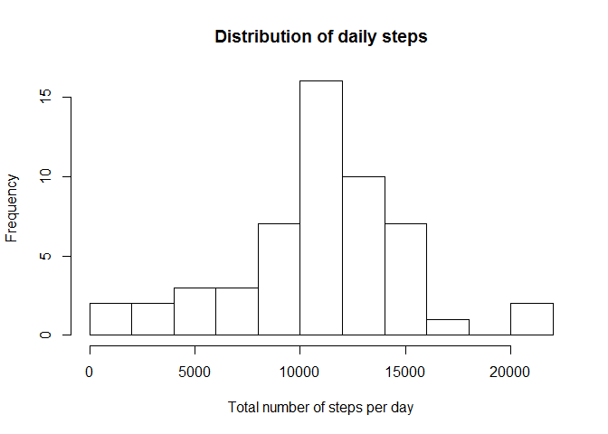
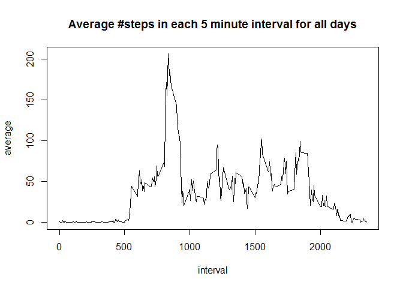
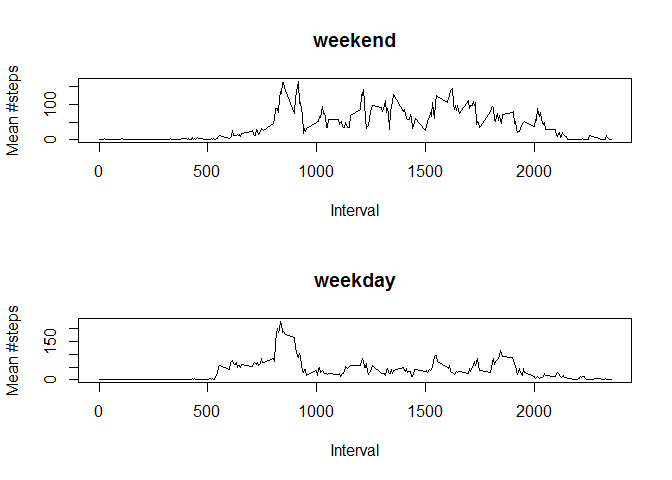

# Reproducible Research: Peer Assessment 1


## Loading and preprocessing the data

```r
fileurl <- "https://d396qusza40orc.cloudfront.net/repdata%2Fdata%2Factivity.zip"
filename <- "./R/activity.zip"

if (!file.exists(filename)) {
    setInternet2(use = TRUE)
    download.file(fileurl, destfile="activity.zip")
}

activitydata <- read.csv(unz("activity.zip", "activity.csv"))
```


## What is mean total number of steps taken per day?

Plotting a histogram of the total number of steps per day as a histrogram ignoring zero value days.


```r
library(plyr)
stepsperday <- ddply(activitydata,.(date),summarize,sum=sum(steps, na.rm=TRUE))
hist(stepsperday[!stepsperday$sum == 0,]$sum, breaks = 10, main = "Distribution of daily steps", xlab="Total number of steps per day")
```

 

The mean and medial values of the daily total are:


```r
summarise(stepsperday, mean=mean(sum), median=median(sum))
```

```
##      mean median
## 1 9354.23  10395
```

## What is the average daily activity pattern?


```r
intervalaverage <- ddply(activitydata, .(interval), summarize,average=mean(steps, na.rm=TRUE))
plot(intervalaverage, type="l")
title("Average #steps in each 5 minute interval for all days")
```

 

The 5-minute interval, on average across all the days in the dataset, with the maximal number of steps is:


```r
intervalaverage[which.max(intervalaverage[,2]),]
```

```
##     interval  average
## 104      835 206.1698
```

## Imputing missing values

The total number of missing values is:

```r
sum(is.na(activitydata$steps))
```

```
## [1] 2304
```

Fill missing values with average for the interval using the previously calculated average number of steps per interval and plot the distribution of the steps.


```r
temp <- join(activitydata, intervalaverage, by="interval", type="left", match="all")
temp$interpolated <- ifelse(is.na(temp$steps),temp$average,temp$steps)

newstepsperday <- ddply(temp,.(date),summarize,sum=sum(interpolated))
hist(newstepsperday$sum, breaks = 10, main = "Distribution of daily steps", xlab="Total number of steps per day (missing data filled)")
```

 

The mean and median for the imputed data set are:


```r
summarise(newstepsperday, mean=mean(sum), median=median(sum))
```

```
##       mean   median
## 1 10766.19 10766.19
```

Both averages have increased and the mean and median numbers have converged.

## Are there differences in activity patterns between weekdays and weekends?

Firstly, the interpolated data is subsetted between weekdays and weekends before being summarised by taking the mean for each interval.


```r
weekdays <- c('Monday', 'Tuesday', 'Wednesday', 'Thursday', 'Friday')
temp$weekday <- weekdays(as.Date(temp$date)) 
weekdaySub <- subset(temp, weekday %in% weekdays)
weekdaystepsperday <- ddply(weekdaySub,.(interval),summarize,mean=mean(interpolated))
weekendSub <- subset(temp, !(weekday %in% weekdays))
weekendstepsperday <- ddply(weekendSub,.(interval),summarize,mean=mean(interpolated))
par(mfrow=c(2,1), xpd=NA)
plot(weekendstepsperday$interval, weekendstepsperday$mean, type="l", main="weekend", xlab="Interval", ylab="Mean #steps")
plot(weekdaystepsperday$interval, weekdaystepsperday$mean, type="l", main="weekday", xlab="Interval", ylab="Mean #steps")
title(ylab="Number of steps", outer=TRUE)
```

 

It is apparent that there is less activity on the weekdays.
